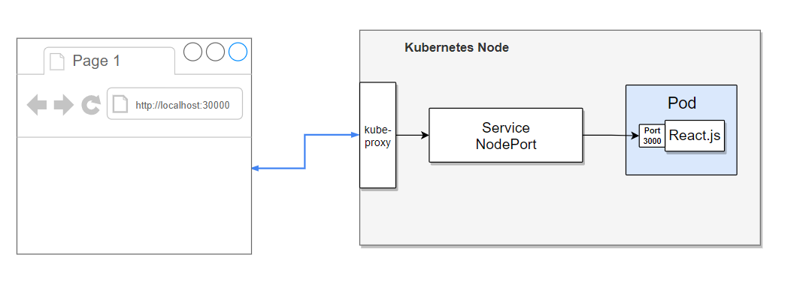

# React Pod

This is a containerized React app running inside a Pod, which is in a node, in a Kubernetes cluster.

The internal port of the Node is then exposed to the outside using a NodePort service, which, in this case, maps internal port '3000' to port '30000'.

This project includes a skaffold configuration file, which can be call with the command line skaffold, that helps facilitate the continous deployment for Kubernetes on your local machine for a better local development environment.
